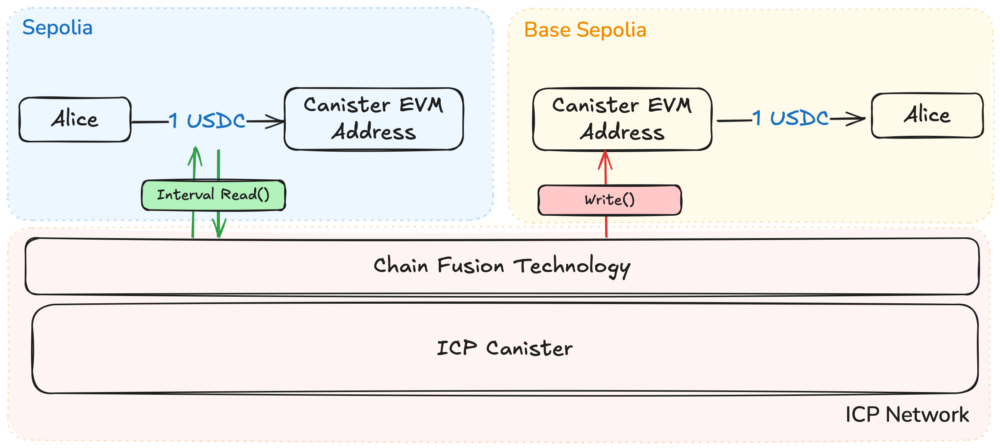

# IC Bridge

IC Bridge, is a simple proof-of-concept cross-chain bridge built on ICP, written Rust, that facilitates the bridging of USDC Testnet Tokens from Sepolia to Base Sepolia and vice versa. It heavily relies on the [IC-Alloy](https://ic-alloy.dev) Rust Library to abstract a lot of complexities involved with interacting with the EVM RPC and building an EIP-1559 transaction .

This project is the 1st prize winner for the [2024 Chain Fusion Hacker House Devcon Bankok](https://github.com/ICP-Hacker-House/Devcon_BKK?tab=readme-ov-file#2024-chain-fusion-hacker-house-devcon-bangkok), specifically the [Chain Fusion Track](https://github.com/ICP-Hacker-House/Devcon_BKK?tab=readme-ov-file#2-chain-fusion--total-prize-pool-of-usd-5k).

### Outline
- IC Bridge POC Architecture
- The use of Chain Fusion Technology and Timers in this project
- Quick Codebase walk through and explanation
- Deploy the project Locally
- Deploy the project on Mainnet

## IC Bridge POC Architecture
A SENDER will transfer a small amount of USDC to the Canister's EVM address in the **Sepolia** chain. The canister will pick up the transfer event and send the same corresponding amount to the SENDER's address on the **Base Sepolia** chain, the same logic applies in the other direction, from Base Sepolia to Sepolia. Hence achieving a simple POC for a cross-evm bridge.



This approach demonstrates a simple yet effective proof of concept for a cross-EVM bridge by utilizing a liquidity provisioning model. The bridge maintains dedicated pools of USDC on both networks, enabling instant and seamless token transfers without the need for actual cross-chain token movements.

## The use of Chain Fusion Technology and Timers in this project
Chain Fusion Technology, uses [Threshold ECDSA](https://internetcomputer.org/docs/current/developer-docs/smart-contracts/signatures/t-ecdsa), which allows canisters to have an ECSDA Public Key as well as sign messages. This imples that they are able to create valid EIP-1559 transactions.

Utilizing [HTTP Outcalls](https://internetcomputer.org/https-outcalls), canisters are able to perform read and write operations securely to any EVM Chain, and most importantly, they can do so in an decentralized manner.

Moreover, with [Timers](https://internetcomputer.org/docs/current/developer-docs/smart-contracts/advanced-features/periodic-tasks/#timers), canisters can autonomously read transactions on an EVM Chain. What we mean by this is that without user intervention, we can set the Canister to periodically call the read function to detect transactions, therefore achieving autonomy.

Once the Canister picks up a transfer event targeted towards the Canister's EVM Address on one chain, it will trigger the transfer function directed towards the SENDER address on the other chain.

This project combines the three principles mentioned above: [Threshold ECDSA](https://internetcomputer.org/docs/current/developer-docs/smart-contracts/signatures/t-ecdsa), [HTTP Outcalls](https://internetcomputer.org/https-outcalls) and [Timers](https://internetcomputer.org/docs/current/developer-docs/smart-contracts/advanced-features/periodic-tasks/#timers) to create a cross-evm bridge POC in the Rust.

## Code Walk Through

The core logic resides in **[lib.rs](src/ICPBridge_backend/src/lib.rs)**.  We used [IC-Alloy's Toolkit Template](https://github.com/ic-alloy/ic-alloy-toolkit) as heavy inspiration behind our codes.
Below is a quick breakdown of key components:

---

### Timer and Asynchronous Functions

**start_timer_sepolia:**  
Starts a recurring timer that, every N seconds, spawns an asynchronous task (`async_function_sepolia`) to watch for USDC transfers on Sepolia.

**start_timer_base:**  
Starts a recurring timer that, every N seconds, spawns an asynchronous task (`async_transfer_base`) to watch for USDC transfers on Base.

**async_function_sepolia:**  
An async function that calls `watch_usdc_transfer_start_sepolia`, initiating the log-watching process for Sepolia.

**async_transfer_base:**  
An async function that calls `watch_usdc_transfer_start_base`, initiating the log-watching process for Base.

---

### RPC Services

**get_rpc_service_sepolia:**  
Returns a `RpcService` configured to connect to the Sepolia EVM proxy endpoint.

**get_rpc_service_basesepolia:**  
Returns a `RpcService` configured to connect to the Base-Sepolia EVM proxy endpoint.


---

### ECDSA Key Retrieval and Signer

**get_ecdsa_key_name:**  
Determines which ECDSA key name should be used based on the current DFX network environment variable.

**create_icp_signer:**  
Creates an `IcpSigner` instance using the ECDSA key name retrieved by `get_ecdsa_key_name`.

---

### State Management

*(Managed through thread-local variables `STATE`, `ARRAY`, and `LAST_PROCESSED_BLOCK`.)*  
No direct function for initialization—handled automatically on module load. Used by various functions to keep track of timers, logs, and polling state.

---

### Watching for USDC Transfers

**watch_usdc_transfer_start_sepolia:**  
Initiates a log-watching process on the Sepolia network for USDC transfers. If the target address matches the specified receiver, it triggers an asynchronous transfer function (`transfer_usdc_base`).

**watch_usdc_transfer_start_base:**  
Initiates a log-watching process on the Base network for USDC transfers. If the target address matches the specified receiver, it triggers an asynchronous transfer function (`transfer_usdc`).

---

### Queries

**watch_usdc_transfer_is_polling:**  
Returns `true` if a timer-based watcher is currently active and polling for logs, and `false` otherwise.

**data_history:**  
Returns a list of formatted log strings recorded during the watching process.

## Deploy Locally

To get started, you might want to explore the project directory structure and the default configuration file. Working with this project in your development environment will not affect any production deployment or identity tokens.

To learn more before you start working with `IC Bridge`, see the following documentation available online:

- [Quick Start](https://internetcomputer.org/docs/current/developer-docs/setup/deploy-locally)
- [SDK Developer Tools](https://internetcomputer.org/docs/current/developer-docs/setup/install)
- [Rust Canister Development Guide](https://internetcomputer.org/docs/current/developer-docs/backend/rust/)
- [ic-cdk](https://docs.rs/ic-cdk)
- [ic-cdk-macros](https://docs.rs/ic-cdk-macros)
- [Candid Introduction](https://internetcomputer.org/docs/current/developer-docs/backend/candid/)

If you want to start working on your project right away, you might want to try the following commands:

```bash
cd ICBridge/
dfx help
dfx canister --help
```

## Running the project locally

If you want to test your project locally, you can use the following commands:

```bash
# Starts the replica, running in the background
dfx start --background

# Deploys your canisters to the replica and generates your candid interface
dfx deploy
```

Once the job completes, your application will be available at `http://localhost:4943?canisterId={asset_canister_id}`.

If you have made changes to your backend canister, you can generate a new candid interface with

```bash
npm run generate
```

at any time. This is recommended before starting the frontend development server, and will be run automatically any time you run `dfx deploy`.

If you are making frontend changes, you can start a development server with

```bash
npm start
```

Which will start a server at `http://localhost:8080`, proxying API requests to the replica at port 4943.

### Note on frontend environment variables

If you are hosting frontend code somewhere without using DFX, you may need to make one of the following adjustments to ensure your project does not fetch the root key in production:

- set`DFX_NETWORK` to `ic` if you are using Webpack
- use your own preferred method to replace `process.env.DFX_NETWORK` in the autogenerated declarations
  - Setting `canisters -> {asset_canister_id} -> declarations -> env_override to a string` in `dfx.json` will replace `process.env.DFX_NETWORK` with the string in the autogenerated declarations
- Write your own `createActor` constructor


